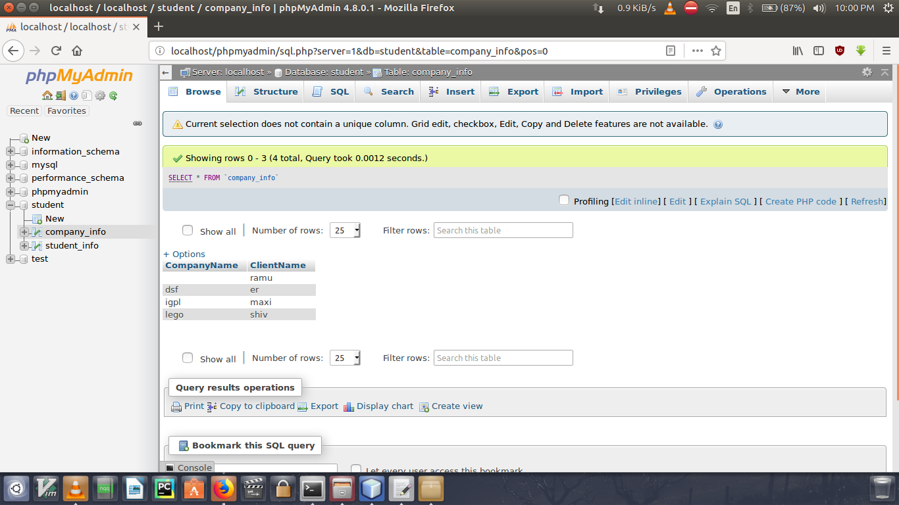

Simple program in java which takes store the information in database,and then retrieve the data from database and display on console.

Here the data which is passed from console is stored in database.

Here the data of the another table i.e. company table.
